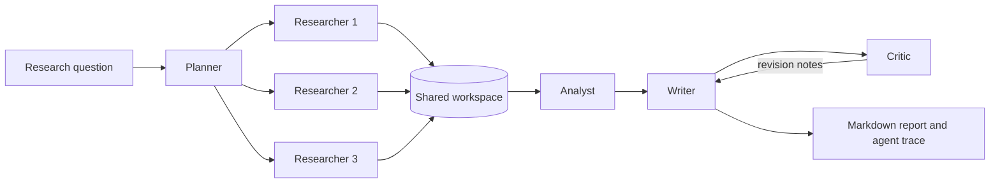

# Multi-Agent Research Assistant

A small, explainable research pipeline in which specialized agents collaborate on an evidence-based brief. It is designed as an undergraduate project exploring multi-agent coordination, task decomposition, parallel execution, shared state, and quality control.

The scheduling extension explores a focused question: **under limited researcher concurrency, how does predicted task length affect waiting time?** It includes a rule-based length proxy, FCFS and predicted-shortest-first (SJF) execution, and a reproducible simulation of duration-prediction errors. This is an AI-assisted undergraduate prototype, not a reproduction of Prompt2Length or JDPMHF and not a GPU scheduler.

## Why this project

One large prompt hides the work inside a single model call. This project exposes the workflow:



The retrieval agents run concurrently. In live mode, the planner, each researcher, the analyst, the writer, and the critic make separate model calls and exchange results through the shared workspace. Every piece of evidence keeps its source ID, title, URL, excerpt, and relevance score. The critic checks that the report does not cite unknown sources. The orchestrator records the execution time of every agent.

## Quick start

Requires Python 3.10 or later and no third-party packages.

```bash
python -m venv .venv
source .venv/bin/activate
pip install -e .
research-agents "How can job-duration prediction improve LLM inference scheduling?"
```

The offline mode retrieves evidence deterministically from `examples/sources.json`, so the complete pipeline can be demonstrated without an API key. The report is saved to `reports/report.md`.

To use a chat-completions-compatible model across all agent roles:

```bash
export LLM_API_KEY="your-key"
export LLM_MODEL="your-model"
export LLM_BASE_URL="https://api.openai.com/v1"
research-agents "How can job-duration prediction improve LLM inference scheduling?" --live
```

Do not commit API keys. The `.gitignore` excludes `.env` files.

## Run tests

```bash
python -m unittest discover -s tests -v
```

## Reproducible demonstration

### English

Run the smallest scheduling example after `pip install -e .`:

```bash
python examples/demo_scheduling.py
```

The example has one worker and three tasks. All tasks arrive at time zero, with actual and predicted durations `[8, 2, 1]`. FCFS preserves the input order; SJF uses the predicted durations to run shorter tasks first.

```text
FCFS order: [1, 2, 3]
  task 1: start=0, finish=8
  task 2: start=8, finish=10
  task 3: start=10, finish=11
  mean wait: 6.000
  makespan: 11.000

SJF order: [3, 2, 1]
  task 3: start=0, finish=1
  task 2: start=1, finish=3
  task 1: start=3, finish=11
  mean wait: 1.333
  makespan: 11.000
```

In this example, shortest-first scheduling reduces mean waiting time, while total completion time stays at 11. The simulator uses actual durations only to advance time; the scheduler selects tasks using predicted durations.

Run the complete offline research pipeline and inspect its trace:

```bash
research-agents "How can prediction improve multi-agent scheduling?" --workers 1 --policy sjf
python -m json.tool reports/report.trace.json
```

The offline planner currently creates questions in short-to-long order, so FCFS and SJF may choose the same order for this built-in source packet. The standalone example above puts the long task first to make the scheduling difference visible. Live planner outputs and larger task sets can arrive in other orders.

### 中文

完成 `pip install -e .` 后运行最小调度示例：

```bash
python examples/demo_scheduling.py
```

示例包含一个执行名额和三个同时到达的任务。实际时长和预测时长均为 `[8, 2, 1]`。FCFS 保留输入顺序，SJF 根据预测时长让较短任务先执行。

```text
FCFS 顺序：[1, 2, 3]
平均等待时间：6.000
全部任务完成时间：11.000

SJF 顺序：[3, 2, 1]
平均等待时间：1.333
全部任务完成时间：11.000
```

在这个例子中，短任务优先降低了平均等待时间，但全部任务完成时间仍为 11。仿真器只用实际时长推进时间，调度器只能根据预测时长选择任务。

运行完整的离线多 Agent 研究流程并查看追踪记录：

```bash
research-agents "How can prediction improve multi-agent scheduling?" --workers 1 --policy sjf
python -m json.tool reports/report.trace.json
```

当前离线 Planner 默认按短、中、长生成问题，因此在内置示例数据中，FCFS 与 SJF 可能得到相同顺序。上面的独立示例故意把长任务放在最前面，使两种策略的区别清楚可见。Live 模式和更大的任务集合可能产生其他顺序。

## Scheduling experiment

From the repository root after installation:

```bash
research-agents "How can job-duration prediction improve LLM inference scheduling?" --policy sjf --workers 2
python -m research_agents.benchmark --seeds 20 --tasks 30 --workers 2 --output reports/scheduling.csv
```

The pipeline submits researcher tasks in FCFS or estimated-length order, respecting the worker limit. Downstream analysis waits for all researchers. With three tasks and three free workers there is little ordering opportunity; use one or two workers to create contention. This is static ordering of a ready batch, not preemption or adaptive replanning.

Reports have a `.trace.json` sidecar with researcher queue time, service time, task ID, length bucket and policy. Live runs also save `.calls.json` with provider-reported token usage and end-to-end call latency. Missing token counts stay null. API latency includes network and provider-side queuing; it is not isolated GPU inference time. Keys and prompt contents are not included in these logs.

The length heuristic uses question wording only and returns **relative units**, not exact tokens or milliseconds. It is not calibrated and may be inaccurate. The separate simulator studies controlled prediction errors using synthetic durations; it does not evaluate the heuristic's predictive accuracy. See [experiment design and results](docs/EXPERIMENTS.md) and the [Chinese walkthrough](docs/LEARNING_GUIDE_ZH.md).

## What the experiment demonstrates

- Role specialization: planning, retrieval, synthesis, writing, and critique are separate responsibilities.
- Coordination: agents communicate through a typed shared workspace rather than hidden global variables.
- Parallel scheduling: three retrieval tasks run in a thread pool.
- Traceability: evidence retains source metadata and the output includes an agent execution trace.
- Graceful deployment: offline mode is reproducible; live mode coordinates seven separate model-agent calls before any revision.

## Current limitations

- Retrieval uses lexical overlap over user-supplied sources rather than a search engine or vector database.
- Chinese text is matched with character bigrams, not semantic or cross-language retrieval.
- The offline writer summarizes evidence without generating new prose.
- The offline critic validates citation identifiers. The live critic also reviews the original excerpts, but cannot guarantee truth. Unresolved findings are saved in the report after at most one rewrite.
- The live provider targets the common chat-completions format and may need adaptation for other APIs.
- Remote API failures still stop the run; retries, persistent checkpoints and per-call role IDs are future work.
- No live GPU experiment, trained prediction model, answer-quality benchmark or speedup claim is provided.

## Next experiments

1. Collect real per-role traces and fit a small duration predictor using a held-out test split.
2. Compare FCFS and SJF on identical prompts, models, evidence, concurrency and token budgets over repeated runs.
3. Add task dependencies and compare critical-path scheduling with short-task priority.
4. Evaluate citation support and completeness with and without the critic revision loop.

## Author

Zishuo Chen, Computer Science and Technology undergraduate at Wenzhou-Kean University.
