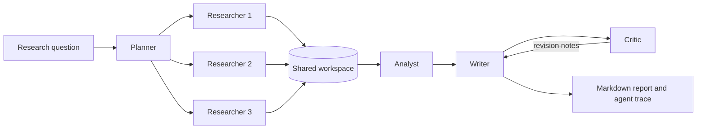

# Multi-Agent Research Assistant

A small, explainable research pipeline in which specialized agents collaborate on an evidence-based brief. It is designed as an undergraduate project exploring multi-agent coordination, task decomposition, parallel execution, shared state, and quality control.

## Why this project

One large prompt hides the work inside a single model call. This project exposes the workflow:



The retrieval agents run concurrently. Every piece of evidence keeps its source ID, title, URL, excerpt, and relevance score. The critic checks that the report does not cite unknown sources. The orchestrator records the execution time of every agent.

## Quick start

Requires Python 3.10 or later and no third-party packages.

```bash
python -m venv .venv
source .venv/bin/activate
pip install -e .
research-agents "How can job-duration prediction improve LLM inference scheduling?"
```

The offline mode retrieves evidence deterministically from `examples/sources.json`, so the complete pipeline can be demonstrated without an API key. The report is saved to `reports/report.md`.

To use a chat-completions-compatible model for writing and revision:

```bash
export LLM_API_KEY="your-key"
export LLM_MODEL="your-model"
export LLM_BASE_URL="https://api.openai.com/v1"
research-agents "How can job-duration prediction improve LLM inference scheduling?" --live
```

Do not commit API keys. The `.gitignore` excludes `.env` files.

## Run tests

```bash
python -m unittest discover -s tests -v
```

## What the experiment demonstrates

- Role specialization: planning, retrieval, synthesis, writing, and critique are separate responsibilities.
- Coordination: agents communicate through a typed shared workspace rather than hidden global variables.
- Parallel scheduling: three retrieval tasks run in a thread pool.
- Traceability: evidence retains source metadata and the output includes an agent execution trace.
- Graceful deployment: offline mode is reproducible; live mode can use an external language model.

## Current limitations

- Retrieval uses lexical overlap over user-supplied sources rather than a search engine or vector database.
- The offline writer summarizes evidence without generating new prose.
- The critic validates citation identifiers, not the semantic truth of every statement.
- The live provider targets the common chat-completions format and may need adaptation for other APIs.

## Next experiments

1. Compare sequential and parallel retrieval latency as the number of agents grows.
2. Assign different source domains to different retrieval agents.
3. Add a token or latency budget and let the orchestrator choose which agent runs next.
4. Evaluate answer quality with and without the critic revision loop.

## Author

Zishuo Chen, Computer Science and Technology undergraduate at Wenzhou-Kean University.
