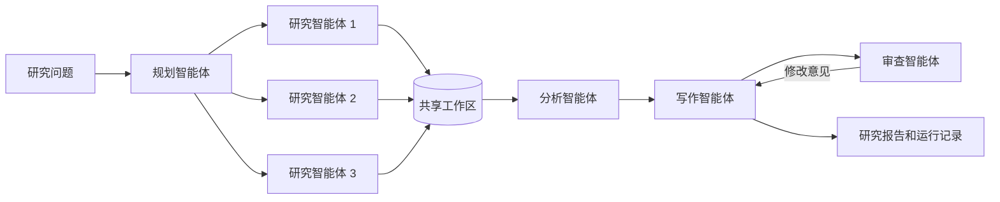

# 多智能体研究助手

[](README.md)
[](README.zh-CN.md)

这是一个小型、可解释的研究流程，由不同角色的智能体协作生成有证据支持的研究简报。项目面向本科阶段学习，涉及多智能体协作、任务分解、并行执行、共享状态和质量检查。

调度扩展研究一个具体问题：**研究智能体的并发名额有限时，预测任务长度会怎样影响等待时间？** 项目包括默认的长度估计规则、可选的可训练输出长度基线、先来先服务和预测短任务优先两种执行策略，以及可复现的任务时长预测误差仿真。这是使用 AI 辅助开发的本科原型，没有复现 Prompt2Length 或 JDPMHF，也不是 GPU 调度器。

## 项目目的

一个大型提示词会把全部工作隐藏在一次模型调用中。这个项目把工作流程显式呈现出来：



检索智能体可以并发运行。在在线模式下，规划、检索、分析、写作和审查角色分别调用模型，并通过共享工作区交换结果。每条证据保留来源编号、标题、网址、摘录和相关度。审查智能体检查报告是否引用未知来源，协调器记录每个智能体的运行时间。

## 快速开始

项目需要 Python 3.10 或更高版本，不依赖第三方软件包。

```bash
python -m venv .venv
source .venv/bin/activate
pip install -e .
research-agents "How can job-duration prediction improve LLM inference scheduling?"
```

离线模式从 `examples/sources.json` 中确定性检索证据，无需 API 密钥即可演示完整流程。报告保存到 `reports/report.md`。

如需让全部智能体角色调用兼容 Chat Completions 的模型：

```bash
export LLM_API_KEY="your-key"
export LLM_MODEL="your-model"
export LLM_BASE_URL="https://api.openai.com/v1"
research-agents "How can job-duration prediction improve LLM inference scheduling?" --live
```

请勿提交 API 密钥。`.gitignore` 已排除 `.env` 文件。

## 运行测试

```bash
python -m unittest discover -s tests -v
```

## 可复现演示

完成 `pip install -e .` 后运行最小调度示例：

```bash
python examples/demo_scheduling.py --lang zh
```

示例包含一个执行名额和三个同时到达的任务。实际时长和预测时长均为 `[8, 2, 1]`。先来先服务保留输入顺序，预测短任务优先根据预测时长让较短任务先执行。

```text
FCFS 顺序: [1, 2, 3]
  任务 1：开始=0，结束=8
  任务 2：开始=8，结束=10
  任务 3：开始=10，结束=11
  平均等待时间：6.000
  全部任务完成时间：11.000

SJF 顺序: [3, 2, 1]
  任务 3：开始=0，结束=1
  任务 2：开始=1，结束=3
  任务 1：开始=3，结束=11
  平均等待时间：1.333
  全部任务完成时间：11.000
```

在这个例子中，短任务优先降低了平均等待时间，但全部任务完成时间仍为 11。仿真器只用实际时长推进时间，调度器只能根据预测时长选择任务。

运行完整的离线多智能体研究流程并查看追踪记录：

```bash
research-agents "How can prediction improve multi-agent scheduling?" --workers 1 --policy sjf
python -m json.tool reports/report.trace.json
```

当前离线规划智能体默认按短、中、长生成问题，因此在内置示例数据中，两种策略可能得到相同顺序。上面的独立示例故意把长任务放在最前面，使策略区别清楚可见。在线模式和更大的任务集合可能产生其他顺序。

## 训练输出长度基线

项目把 [Prompt2Length](https://doi.org/10.1109/AIAHPC66801.2025.11290434) 公开介绍中的三个思路转化为一个容易检查的学习实验：过滤异常标签、替换控制输出长度的提示词进行数据增强，以及只根据输入提示预测输出长度区间。当前实现使用透明文本特征和标准化岭回归，**不是**论文中的 DistilBERT 架构，也不构成论文实验复现。

先用项目提供的合成数据训练模型，再让该模型参与研究任务调度：

```bash
python -m research_agents.length_model \
  --data examples/synthetic_length_observations.jsonl \
  --output reports/length_model.json

research-agents "How can prediction improve multi-agent scheduling?" \
  --workers 1 --policy sjf --length-model reports/length_model.json
```

使用随机种子 7 时，仓库中的 28 条合成记录会分为 21 条训练样本和 7 条测试样本。使用提示词增强时，留出集 MAE 为 51.085 个相对输出单位，长度区间准确率为 1.000；关闭增强时，MAE 为 58.437，区间准确率仍为 1.000。这组很小的合成结果只用于确认实验链路可运行，不能证明真实场景准确率，也不能说明优于 Prompt2Length。研究任务追踪会记录每次估计来自 `rule-baseline` 还是 `standardized-ridge-baseline`。

## 调度实验

安装项目后，在仓库根目录运行：

```bash
research-agents "How can job-duration prediction improve LLM inference scheduling?" --policy sjf --workers 2
python -m research_agents.benchmark --seeds 20 --tasks 30 --workers 2 --output reports/scheduling.csv
```

流程按照先来先服务或预计长度顺序提交研究任务，并遵守执行名额限制。所有研究任务结束后，分析智能体才会运行。三个任务拥有三个空闲名额时，排序通常不会产生明显作用；使用一到两个名额可以形成排队。当前实现对一批就绪任务进行静态排序，不支持任务抢占或运行中的动态重调度。

报告旁会生成 `.trace.json` 文件，记录研究任务的排队时间、执行时间、任务编号、长度区间和策略。在线运行还会生成 `.calls.json`，保存服务商返回的 token 用量和端到端调用延迟。服务商没有返回的 token 数量会保留为空。API 延迟包含网络和服务端排队时间，不能视为独立的 GPU 推理时间。日志不保存密钥或提示词内容。

两种长度估计器都只读取问题措辞，输出的是**相对单位**，不是准确的 token 数或毫秒数。岭回归模型只使用合成标签训练，尚未针对真实模型服务进行校准。独立仿真器研究受控的时长预测误差，不能证明估计器在真实场景中的准确率。详细信息见[实验设计与结果](docs/EXPERIMENTS.md)和[项目更迭日志](CHANGELOG.zh-CN.md)。

## 实验展示的内容

- 角色分工：规划、检索、分析、写作和审查各自承担不同职责。
- 协作方式：智能体通过类型明确的共享工作区通信。
- 并行调度：三个检索任务在线程池中运行。
- 可追踪性：证据保留来源信息，输出包含智能体运行记录。
- 可部署性：离线模式可以复现；在线模式在修改前会进行七次独立的模型角色调用。

## 当前限制

- 检索功能在用户提供的来源中计算词语重合度，没有接入搜索引擎或向量数据库。
- 中文检索使用字符二元组，不具备语义检索或跨语言检索能力。
- 离线写作智能体汇总已有证据，不生成新的文章表达。
- 离线审查智能体检查引用编号；在线审查还会读取原始摘录，但无法保证事实完全正确。系统最多修改一次，并在报告中保留尚未解决的问题。
- 在线服务商使用常见的 Chat Completions 接口，其他 API 可能需要适配。
- 远程调用失败会终止运行；自动重试、持久化检查点和单次调用角色编号仍待实现。
- 当前学习基线只使用少量合成数据和人工设计特征；项目尚未复现 Transformer 模型、开展真实 GPU 实验或回答质量基准测试，也没有声称获得真实加速效果。

## 后续实验

1. 用各角色的真实输出 token 记录替代合成标签，并在完全独立的测试集上与常数、角色均值和规则基线比较。
2. 在提示词、模型、证据、并发名额和 token 预算相同的条件下，多次比较两种策略。
3. 加入任务依赖，比较关键路径调度和短任务优先。
4. 比较有无审查与修改循环时的引用支持度和报告完整性。

## 作者

Zishuo Chen，温州肯恩大学计算机科学与技术专业本科生。
